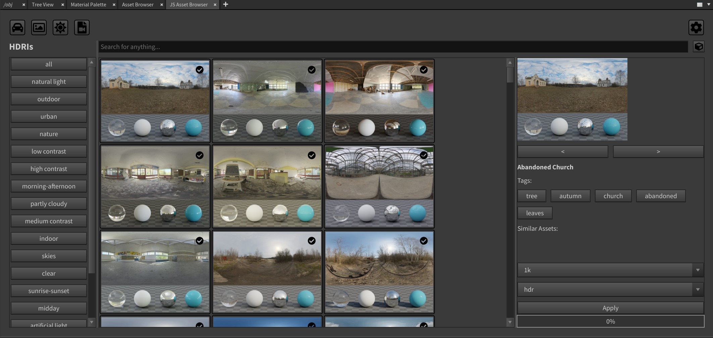

# AssetBrowser
A qt asset browser for applications like houdini/nuke/maya/blender



Currently in development

Note: 
Only houdini + nuke plugin available during development

The tools is written in Python 3 !

## Install
To install this tool set clone this repo into a local folder. (e.g. D:/Documents/).

### Houdini
Modify the *jsAssetBrowser.json* file that the jsAssetBrowser variable points to the plugins/houdini folder in the local clone of the repository (absolut path).
Copy the *jsAssetBrowser.json* file to the $HFS/packages folder. (e.g. D:/Documents/houdini18.0/packages)

The Asset Browser can be added as a Panel using the Python Panel Edit Tab Menu option (cogwheel top left of panel). And add the "Project Viewer (projectViewer)"-Interface to te Pane Tab Menu Entries.

### Nuke

#### Nuke Plugin Manager
It's recomended to us the Nuke Plugin Manager. 
See the following link for a more indepth description:<br>
https://github.com/jonassorgenfrei/NukePluginManager
<br>You can find the necessary jsAssetBrwoser.json file in the plugins/nuke folder.

#### Manual

To append the plugin to nuke, you have to add the required paths to the nuke init file.
E.g. add the following to your ```<user home directory>/.nuke/init.py``` file
```
import nuke
import sys

jsAssetBrowserPath = "<PATH_TO_THE_JS_ASSET_BROWSER_ROOT_DIR"

sys.path.append("{}/src".format(jsAssetBrowserPath))
nuke.pluginAddPath("{}/plugins/nuke/scripts".format(jsAssetBrowserPath))
```

Note: the AssetBrowser does only work with Nuke 12 and later due to the dependency of PySide2.

### Maya
Not supported yet.

### Blender
Not supported yet.

## Plugins
This Module allows to add plugins for custom websites or specific file data structures/bases.

To create a plugin create a new folder for the plugin in lib/jsAssetBrowser/plugins and append the name to the plugin in plugins.json.
Note the main module file must have the same name as the folder e.g. myPlugin/myPlugin.py and needs to implement a Plugin-Class which implements the abstract PluginInterface class. (see: polyheaven as example)

In futur versions the json file will be created on runtime to manage plugins given the ability to enable or disable plugins.

### Developer

## Qt
When changing the resource file in jsAssetBrowser/ui/*.qrc the file needs to be compiled.

```
pyside2-rcc <ressourceFile>.qrc -o <ressourceFile>_rc.py
```

It then can be imported using
```
from jsAssetBrowser.ui import <ressourceFile>_rc
```

Where <ressourceFile> is the file name for the resources with the ending .qrc